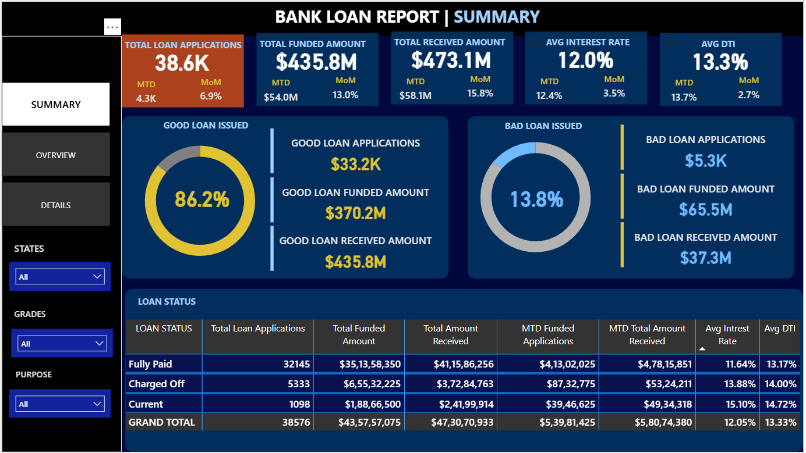
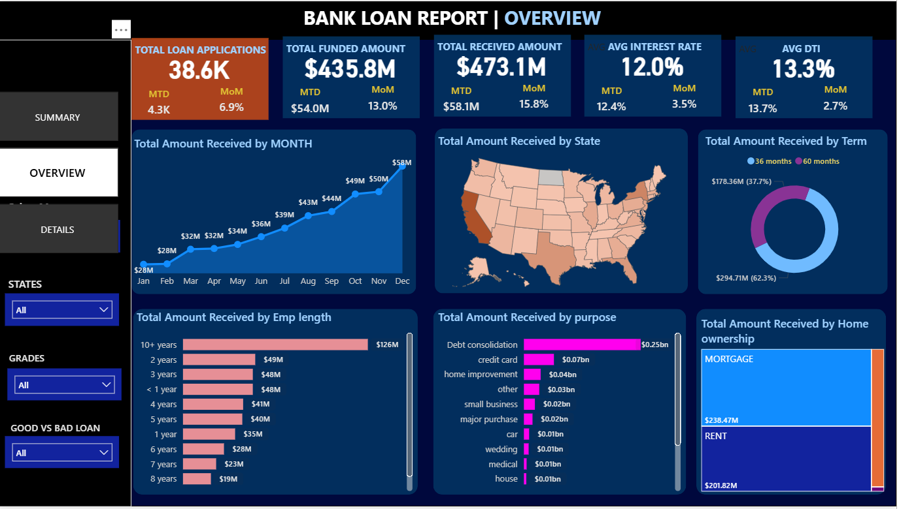
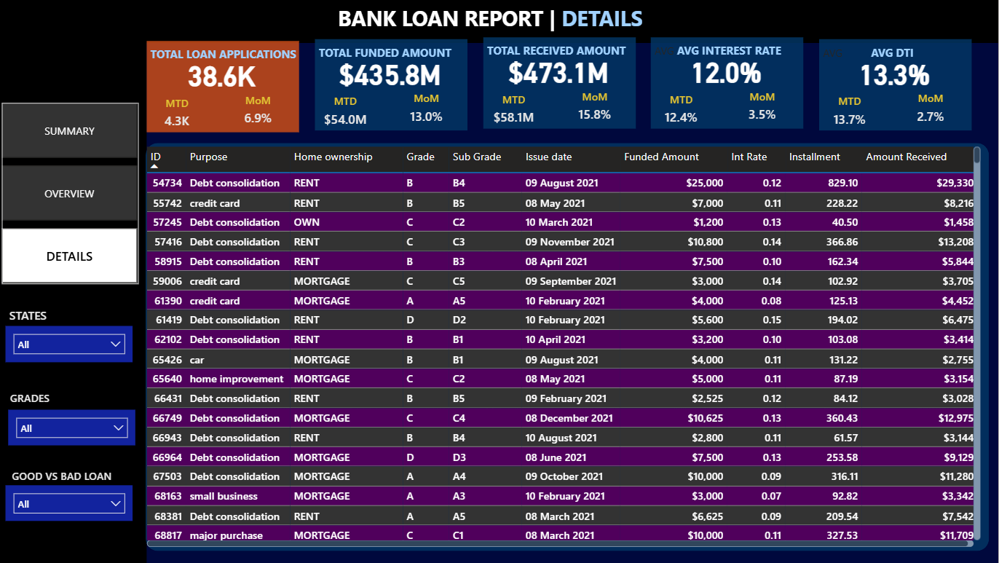

# 📊 Bank Loan Analysis Dashboard

## 📌 Project Overview

This project analyzes bank loan data to uncover key insights related to loan performance, customer behavior, and risk assessment. The dashboard helps in understanding trends in loan applications, funding, repayments, and risk levels.

---

## 🛠️ Tools & Technologies

* SQL
* Power BI
* Excel
* DAX

---

## 📂 Project Files

* `01_Bank Loan Analysis.pbix` → Power BI dashboard
* `02_Financial Loan.csv` → Dataset
* `03_Bank Loan Report Query.sql` → SQL queries
* `04_BANK LOAN REPORT QUERY DOCUMENT.docx` → Query explanation
* `05_Bank Loan PPT Power Bi.pptx` → Presentation
* `06_Domain Knowledge DOC.docx`
* `07_Terminologies in Data.docx`

---

## 📊 Key KPIs

* Total Loan Applications
* Total Funded Amount
* Total Amount Received
* Average Interest Rate
* Average DTI

---

## 📈 Dashboard Features

* Interactive filters (State, Grade, Loan Status)
* Monthly trends analysis
* Loan purpose & customer segmentation
* Good vs Bad loan analysis

---

## 📷 Dashboard Preview

---

## 🧠 Domain Knowledge

* Loan lifecycle understanding
* Risk analysis using DTI & interest rate
* Customer segmentation

---

## 🚀 Conclusion

This project demonstrates strong data analysis, visualization, and business understanding using Power BI and SQL.
